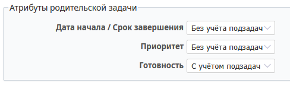
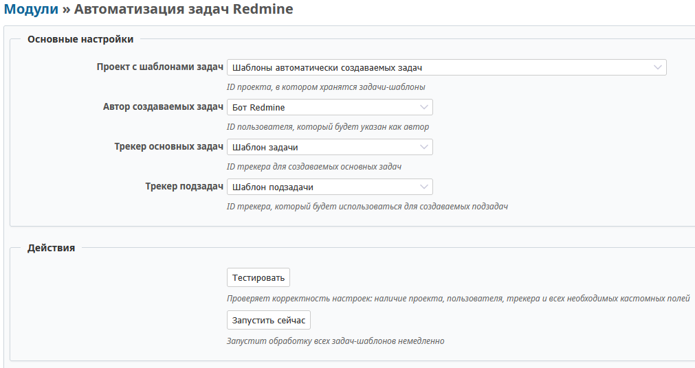
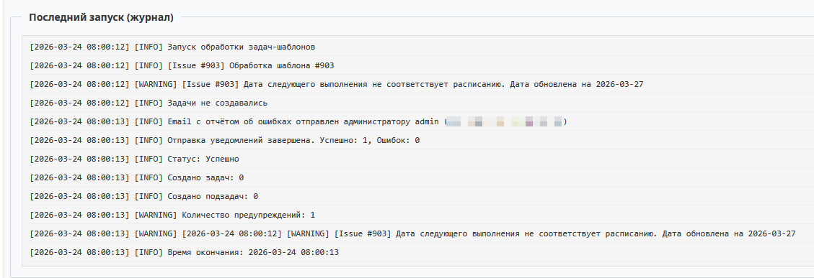

# Настройка плагина Redmine Task Automation

## Предварительная настройка Redmine

### Настройка атрибутов родительских задач

1. Перейдите: **Администрирование → Настройки**
2. Откройте вкладку **«Задачи»**
3. Найдите блок **«Атрибуты родительской задачи»**
4. Установите следующие поля в состояние **«Без учёта подзадач»**:
   - Дата начала / Срок завершения
   - Приоритет

## Создание пользовательских полей

Необходимо создать следующие пользовательские поля в Redmine:

| Тип | Имя | Значения | По умолч. | Рег. выражение | Обяз. | Задача | Подзадача |
|-----|-----|----------|-----------|----------------|-------|--------|-----------|
| Текст | Проект назначения | | | | ✓ | ✓ | |
| Текст | Трекер | | | | ✓ | ✓ | ✓ |
| Текст | Назначение | | | | ✓ | ✓ | |
| Текст | Наблюдатели | | | | | ✓ | |
| Целый | Интервал | | 1 | `^[1-9]\d*$` | ✓ | ✓ | |
| Список | Единица интервала | день неделя месяц год | месяц | | ✓ | ✓ | |
| Целый | Номер | | | `^[1-5]$` | | ✓ | |
| Список* | Дни повторения | пн вт ср чт пт сб вс | | | | ✓ | |
| Список | Месяц | янв фев мар апр май июн июл авг сен окт ноя дек | | | | ✓ | |
| Целый | Создать заранее | | 0 | `^\d+$` | ✓ | ✓ | |
| Целый | Порядковый номер | | 1 | `^\d+$` | ✓ | | ✓ |
| Целый | Срок выполнения | | 0 | `^\d+$` | ✓ | ✓ | ✓ |
| Дата | Дата следующего выполнения | | | | ✓ | ✓ | |
| Логич. | Конец в рабочий день | | Нет | | ✓ | ✓ | ✓ |

**\*** — Множественный выбор.

> **Важно:** Имя поля должно быть точно, как в таблице. Эти названия занесены в плагин. Если есть потребность изменить название какого-либо поля, то нужно изменить соответствующее значение в файле `plugins/redmine_task_automation/app/models/task_automation/configuration.rb`

### Как создать поле

1. Перейдите: **Администрирование → Пользовательские поля для задач**
2. Нажмите **«Новое поле»**
3. Выберите тип поля
4. Заполните параметры согласно таблице выше
5. Установите видимость для задач/подзадач
6. Сохраните

## Создание проекта для шаблонов

### Создание проекта

1. Перейдите: **Проекты → Новый проект**
2. Заполните:
   - **Имя:** Шаблоны задач (или другое)
   - **Идентификатор:** templates (или другой)
3. Сохраните

### Настройка доступа

Доступ к этому проекту должны иметь:
- Сотрудники, составляющие шаблоны для задач
- Пользователь, от имени которого плагин (бот) будет создавать целевые задачи

## Создание трекеров

В проекте шаблонов необходимо создать **2 трекера**:

### Трекер 1: Для шаблонов основных задач

1. Перейдите в проект шаблонов
2. **Настройки проекта → Трекеры → Новый трекер**
3. **Имя:** Шаблон задачи
4. **Статусы:** Создайте минимум 2 статуса (открыт, закрыт)
5. **Поля:** Добавьте пользовательские поля из таблицы (отмеченные для «Задача»)
6. **Стандартные поля:**
   - Дата начала
   - Срок завершения
   - Описание
7. Сохраните

### Трекер 2: Для шаблонов подзадач

1. **Настройки проекта → Трекеры → Новый трекер**
2. **Имя:** Шаблон подзадачи
3. **Статусы:** Создайте минимум 2 статуса (открыт, закрыт)
4. **Поля:** Добавьте пользовательские поля из таблицы (отмеченные для «Подзадача»)
5. **Стандартные поля:**
   - Родительская задача
   - Описание
6. Сохраните

> **Важно:** Необходимо настроить статусы таким образом, чтобы при создании новой задачи подставлялся статус открытой задачи.

## Настройка плагина

### Доступ к настройкам

Перейдите: **Администрирование → Автоматизация задач**

### Параметры настройки

Заполните следующие данные:

1. **Проект с шаблонами** — проект, в котором находятся шаблоны создаваемых задач
2. **Пользователь** — пользователь, от имени которого будут создаваться новые задачи
3. **Трекер основных задач** — выберите созданный трекер для шаблонов основных задач
4. **Трекер подзадач** — выберите созданный трекер для шаблонов подзадач

### Тестирование настроек

После заполнения настроек нажмите кнопку **«Тестировать»**.

Проверка включает:
- ✅ Наличие трекеров
- ✅ Доступность трекеров для указанного пользователя
- ✅ Наличие всех необходимых полей в этих трекерах
- ✅ Соответствие типов полей

Если тестирование прошло успешно, можно переходить к [созданию шаблонов](USAGE.md).

### Ручной запуск

Кнопка **«Запустить сейчас»** запускает выполнение плагина в ручном режиме. Это может быть необходимо, когда:
- В процессе автоматического запуска произошли ошибки
- Шаблоны остались в стадии готовности к обработке
- После исправления ошибок нужно создать задачи, которые должны были быть созданы сегодня

### Информация о последнем запуске

Ниже на странице настроек находится информация о последнем запуске плагина, взятая из файла журнала.

---

**Следующий шаг:** [Настройка cron](CRON_SETUP.md) для автоматического запуска
