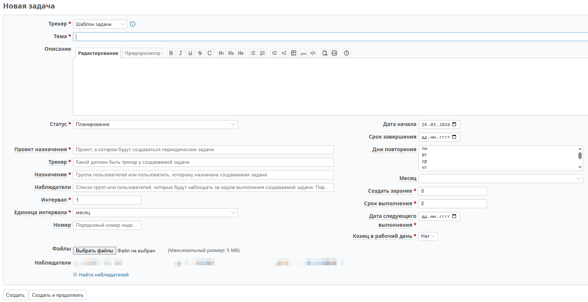
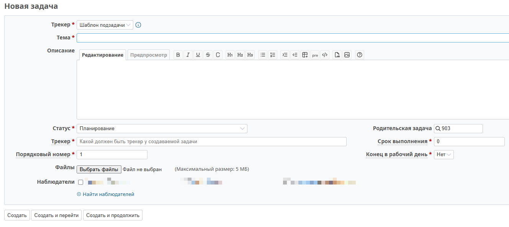

# Использование плагина Redmine Task Automation

## Создание основного шаблона задачи

### Шаг 1: Создание шаблона

1. Перейдите в проект шаблонов
2. Нажмите **«Новая задача»**
3. Выберите трекер **«Шаблон задачи»**



### Шаг 2: Заполнение полей

Обязательные поля помечены красной звёздочкой (*).

#### Основные поля

1. **Трекер** — трекер самого шаблона (Шаблон задачи / Шаблон подзадачи)

2. **Тема** — тема задачи, которая будет создана по этому шаблону. Пишите так, как это будут видеть исполнители целевой задачи.

3. **Описание** — описание целевой задачи. Вся информация, которую должен получить исполнитель.

4. **Статус** — статус шаблона. По умолчанию должно стоять рабочее состояние. Чтобы шаблон перестал работать, измените статус на закрытый.

5. **Дата начала** — если находится в будущем, шаблон не будет обрабатываться до наступления указанной даты.

6. **Срок завершения** — если установлен, шаблон будет обрабатываться до указанной даты (включительно). Если не установлен — шаблон работает бессрочно.

#### Поля назначения

7. **Проект назначения** — проект, в котором будет создаваться задача. Текстовое поле (минимум 3 символа). Можно ввести фрагмент названия проекта.

8. **Трекер** — трекер создаваемой задачи. Необходимо ввести название трекера полностью.

9. **Назначение** — имя или фамилия пользователя, которому будет назначена задача. Можно указать группу пользователей.

10. **Наблюдатели** — пользователи и группы через запятую, которые будут наблюдателями задачи.

#### Поля расписания

11. **Интервал** — целое число > 0. Указывает через сколько «Единиц интервала» должно происходить повторение.

12. **Единица интервала** — день, неделя, месяц, год.

13. **Номер** — число от 1 до 5, указывающее порядковый номер дня недели в месяце. Используется при «Единица интервала» = «неделя».

14. **Дни повторения** — список дней недели. 
    - Если «неделя» — можно выбрать несколько значений (Ctrl + клик)
    - Если «месяц» или «год» — только одно значение
    - Если «день» — игнорируется

15. **Месяц** — трёхбуквенные обозначения месяцев. Используется при «Единица интервала» = «год».

16. **Создать заранее** — за сколько дней до начала исполнения должна быть поставлена задача. Если 0 — задача создаётся в день начала.

17. **Срок выполнения** — количество дней от даты начала до даты завершения. Если 0 — дата завершения = дата начала.

18. **Дата следующего выполнения** — дата начала создаваемой по шаблону задачи. После создания задачи это поле изменится на дату следующего выполнения.

19. **Конец в рабочий день** — если «Да», программа сместит дату окончания назад, если она выпадает на выходной. Нужно учитывать эту особенность, т.к. срок выполнения при этом уменьшится. Если срок выполнения 1 или 2 дня, то необходимо поставить в поле «Создать заранее» число 2 или более. В этом случае исполнитель, получив задачу заранее, сможет отредактировать фактические даты, чтобы окончание не попало на выходной и было достаточно дней для выполнения этой задачи.

### Заполнение дополнительных полей

Если нужно заполнить дополнительные поля целевой задачи, добавьте в поле **«Описание»** после основного текста:

```
Название поля: значение поля
```

**Пример:**
```
Приоритет: высокий
Статус: Новый
```

На каждой строке должно быть только одно поле. После обработки строка будет удалена из целевой задачи.

## Управление расписанием

### Простой способ (числовой период)

Укажите числовой период и единицу измерения:

| Пример | Интервал | Единица | Результат |
|--------|----------|---------|-----------|
| Каждые 10 дней | 10 | день | Задача каждые 10 дней |
| Каждые 3 месяца | 3 | месяц | Задача каждые 3 месяца |
| Каждый год | 1 | год | Задача каждый год |

> **Важно:** Этот способ отталкивается от поля **«Дата следующего выполнения»**.

### Гибкий способ (привязка к дню недели/месяцу)

| Задача | Интервал | Единица | Номер | Дни | Месяц |
|--------|----------|---------|-------|-----|-------|
| Каждую неделю в пн, ср, пт* | 1 | неделя | | пн, ср, пт | |
| Каждую вторую среду | 2 | неделя | | ср | |
| Вторая среда месяца | 1 | месяц | 2 | ср | |
| Последняя пятница месяца | 1 | месяц | 5 | пт | |
| Третий четверг каждого 2-го месяца | 2 | месяц | 3 | чт | |
| Последняя среда июля каждый год | 1 | год | 5 | ср | июл |
| Первый вторник февраля раз в 2 года | 2 | год | 1 | вт | фев |

**\*** Если в поле «Дни повторения» указаны несколько значений, интервал должен быть «1 неделя».

## Создание подзадачи

### Шаг 1: Создание подзадачи

1. Откройте задачу основного шаблона
2. В блоке **«Подзадачи»** нажмите **«Добавить»**



### Шаг 2: Заполнение полей

1. **Трекер** — автоматически заполнится «Шаблон подзадачи»

2. **Тема** — тема подзадачи

3. **Описание** — описание подзадачи

4. **Статус** — статус шаблона подзадачи

5. **Родительская задача** — автоматически заполняется ID родительской задачи

6. **Трекер** — трекер создаваемой подзадачи

7. **Срок выполнения** — количество дней от начала до завершения

8. **Порядковый номер** — порядковый номер в списке подзадач:
   - Подзадачи с одинаковым номером выполняются параллельно
   - Следующая подзадача начинается после завершения предыдущей

9. **Конец в рабочий день** — если «Да», дата окончания сместится вперёд при попадании на выходной

> **Внимание:** Если срок завершения последней подзадачи позже срока родительской задачи, система выдаст предупреждение, но создание не прекратится.

## Примеры использования

### Пример 1: Еженедельный отчёт

- **Интервал:** 1
- **Единица:** неделя
- **Дни повторения:** пт
- **Создать заранее:** 1
- **Срок выполнения:** 2

**Результат:** Задача создаётся каждую пятницу за 1 день до начала (в четверг) со сроком выполнения 2 дня.

### Пример 2: Ежемесячное ревью

- **Интервал:** 1
- **Единица:** месяц
- **Номер:** 1
- **Дни повторения:** пн
- **Создать заранее:** 0
- **Срок выполнения:** 5

**Результат:** Задача создаётся в первый понедельник каждого месяца со сроком 5 дней.

### Пример 3: Цепочка подзадач

**Основная задача:**
- Срок выполнения: 30 дней

**Подзадачи:**
1. Порядковый номер: 1, Срок: 10 дней
2. Порядковый номер: 2, Срок: 15 дней
3. Порядковый номер: 3, Срок: 5 дней

**Результат:** 
- Подзадача 1: дни 1-10
- Подзадача 2: дни 11-25
- Подзадача 3: дни 26-30

---

**См. также:** [Настройка расписания](USAGE.md#управление-расписанием)